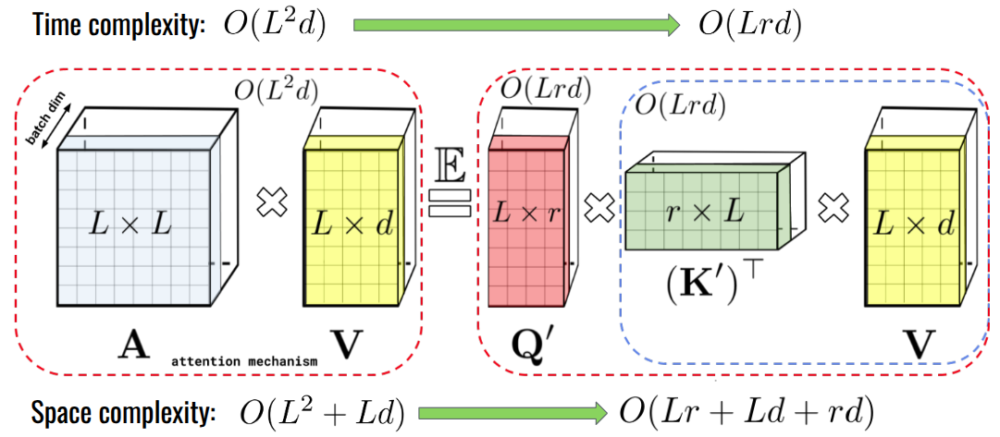
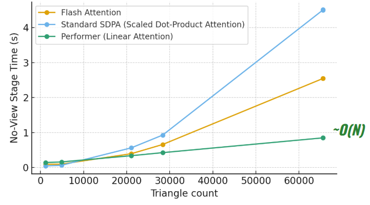

# Training with Linear Attention

# Training/Finetuning Guide

For the implementation of [Performer](https://arxiv.org/abs/2009.14794) as a mechanism for linear attention, we adopt code from [Phil Wang](https://github.com/lucidrains/performer-pytorch/tree/main/performer_pytorch). The full report of our experiments can be read [here](https://docs.google.com/presentation/d/1I7wcdrXZ9zz2HwnHLaQPYCvSGV0oPWOd7iFZ3wE5N0w/edit?usp=sharing).

    
    What Performer Does and its Improvements on Time and Space Complexity [from Rethinking Attention with Performers]

The option for training Renderformer with/without Performer can be toggled by changing the boolean value of the argument `use_performer` of `TransformerEncoder` in `models/renderformer.py`.

A set of commands for fine-tuning/training and inference is provided in  
`train-renderformer.ipynb`

As an attempt to replicate the dataset used by Microsoft in training Renderformer, we write scripts for dataset generation in `dataset-scripts` folder. 

# Results
We fine-tuned the view-independent stage for over 7,000 iterations using Performer, replacing the Scaled Dot-Product Attention (SDPA) used during initial training. The dataset we used is much smaller (774 synthetic scenes compared to 2 million in the original dataset). The following is the result we've achieved. 

    
  Rendered Images for Inference Speed Comparison

    
  Running time of View-independent Stage during Inference for Objects of Different Triangle Counts 

> ⚠️ We found a critical bug regarding gradient graphs in training code which likely explains why the perceptual loss became greater as we fine-tuned further. We are fixing it soon and running all the experiments again. Thank you for your patience. 

